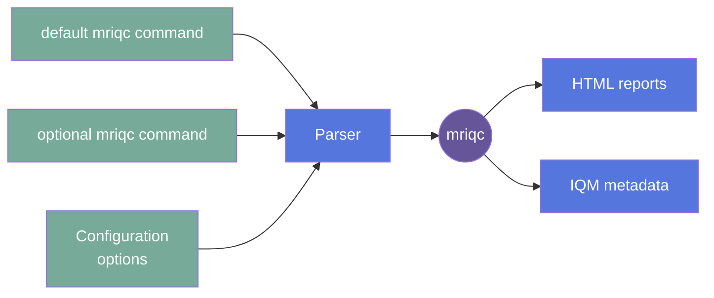

# BIDS MRIQC

BIDS MRIQC: Automatic prediction of quality and visual reporting of MRI scans in BIDS
format

# Update the BIDS algorithm version

1. Fork the repo.
2. [Update the DockerHub image](https://gitlab.com/flywheel-io/scientific-solutions/gears/bids-apps/bids-mriqc/-/blob/main/Dockerfile?ref_type=heads#L52) that the gear will use.
3. Update the [gear-builder line](https://gitlab.com/flywheel-io/scientific-solutions/gears/bids-apps/bids-mriqc/-/blob/main/manifest.json?ref_type=heads#L90) in the manifest.
4. Update the [version line](https://gitlab.com/flywheel-io/scientific-solutions/gears/bids-apps/bids-mriqc/-/blob/main/manifest.json?ref_type=heads#L154) in the manifest.
5. Run `poetry update` from the local commandline (where your cwd is the top-level of the gear). This command will update any dependencies for the Flywheel portion of the gear (not the BIDS algorithm itself!).
6. Run `fw-beta gear build` to update anything in the manifest.
7. Ideally, run `fw-beta gear upload` and complete a test run on your Flywheel instance.
8. Run `git checkout -b {my-update}`, `git commit -a -m "{My message about updating}" -n`, and `git push`.
9. Submit a merge request (MR) to the original gear repo for Flywheel staff to review for official inclusion in the exchange.

## Overview

_{Link To Usage}_

_{Link To FAQ}_

### Summary

MRIQC (23.1.0) extracts no-reference image quality metrics (IQMs) from T1w and T2w
structural and functional magnetic resonance imaging data. For more commandline options,
please visit https://mriqc.readthedocs.io/en/latest/running.html.

### Cite

Esteban O, Birman D, Schaer M, Koyejo OO, Poldrack RA, Gorgolewski KJ; MRIQC: Advancing
the Automatic Prediction of Image Quality in MRI from Unseen Sites; PLOS ONE 12(9):
e0184661; doi:10.1371/journal.pone.0184661

### License

_License:_
Other

### Classification

_Category:_ Analysis

_Gear Level:_

- [x] Project
- [x] Subject
- [x] Session
- [x] Acquisition
- [ ] Analysis

---

[[_TOC_]]

---

### Inputs

- archived_runs
  - "Zip file with data or analyses from previous runs (e.g., FreeSurfer archive"

### Config

- bids_app_command
  - OPTIONAL
  - **Type**: free-text
  - The gear will automatically run the defaults for the algorithm if nothing is
    written in this box (i.e., mriqc bids_dir output_dir participant).
    If you wish to provide the command as you would on a CLI, input the exact
    command here. Flywheel will automatically update the BIDS_dir, output_dir, and
    analysis_level. (e.g., `mriqc bids_dir output participant [arg1 [arg2 ...]]
--no-sub`, where kwargs are any combination of kwargs that are valid for MRIQC)
  - Note: If you use a kwarg here, don't worry about putting a value in the box for
    the same kwarg below. Any kwarg that you see called out in the config UI and that
    is given a value will supersede the kwarg:value given as part of the
    bids_app_command.
  -
- debug

  - **Type**: Boolean
  - **Default**: false
  - Verbosity of log messages; default results in INFO level, True will log DEBUG
    level

- gear-dry-run

  - **Type**: Boolean
  - **Default**: false (set to true for template)
  - Do everything related to Flywheel except actually execute BIDS App command.
  - Note: This is NOT the same as running the BIDS app command with `--dry-run`.
    gear-dry-run will not actually download the BIDS data, attempt to run the BIDS app
    command, or do any metadata/result updating.

- gear-post-processing-only
  - Requires a previous, successful mriqc analysis/gear run archive file
  - Don't run the algorithm; just update the metadata and generate reports based off
    the archived results.
  - Default is false; the entire BIDS download and algorithm will run
- no-sub
  - Turn off submission of anonymized quality metrics to MRIQC’s metrics repository
  - Default reports anonymized metrics

### Outputs

#### Files

- bids-mriqc\*.zip
  - Contains the htmls for the quality report
- sub-{label}\_ses-{label}\*.html.zip
  - Contains the html quality report for the specific file(s))
- job.log
  - Info about what happened on Flywheel
- mriqc_log.txt
  - Nipype's report of the commands that transpired as called by the algorithm
- bids_tree
  - Report from `export_bids` on Flywheel
  -

#### Metadata

IQMs will be reported under the file.info.IQM field for files that were analyzed.

### Pre-requisites

BIDS curation on Flywheel, so that there are entities in file.info.BIDS

#### Prerequisite Gear Runs

Only curation is a pre-requisite.

1. Run the curate-bids gear.
   - Run curation for the subject at a minimum. Project-level analyses will need to
     have had curation run on across all subjects.

#### Prerequisite Files

- T1w, T2w, and/or BOLD images.
- Individual DWI may or may not work. The DWI workflow for the group level is currently
  broken per BUG #1128.

## Usage

Flywheel BIDS App gears allow the user to provide the commandline input that they would
normally run for the BIDS app. The BIDS App Toolkit parses any arguments beyond the
typical `app_name BIDS_dir output_dir analysis_level` when creating the BIDSAppContext
object (see flywheel_bids.flywheel_bids_app_toolkit.context.parse_bids_app_commands).

For Gear Workflow specifics, see CONTRIBUTING.md >> Gear Workflow

### Description

Launch the gear from the project level to run a "group" analysis, as well as update all
participants' metadata with IQM results.

Launch the gear from the subject or session level to run a quick check on the images,
while providing IQM results for only the subject or acquisition.

BIDS-MRIQC is built off the official MRIQC Docker image. The gear downloads all the data
that has undergone BIDS curation for the level from which the gear is launched. The BIDS
directory structure and naming is created/preserved for the MRIQC algorithm to use.

For full flexibility, the bids_app_command field in the input tab should be used as one
would use the commandline to launch an MRIQC analysis. The gear will parse the command
and substitute any Flywheel-specific pieces, so the command can be as simple
as `mriqc bids_dir output participant --my-arg(s)`, where "--my-arg(s)" are any
combination of kwargs that are valid for MRIQC. If no command is supplied, the gear will
proceed with the simplest, default command, `mriqc bids_dir output_dir analysis_level`.

#### File Specifications

### Workflow

Description of workflow

1. Select and supply configuration options
1. Gear parses and cleans options and configurations for `mriqc`
1. Gear uploads HTML reports and IQM results

### Use Cases

Run to assess MRI quality.

### Logging

Debug is the highest number of messages and will report some locations/options and all
errors. If unchecked in the configuration tab, only INFO and higher priority level log
messages will be reported.

## FAQ

[FAQ.md](FAQ.md)

## Contributing

[For more information about how to get started contributing to that gear,
checkout [CONTRIBUTING.md](CONTRIBUTING.md).]

<!-- markdownlint-disable-file -->
